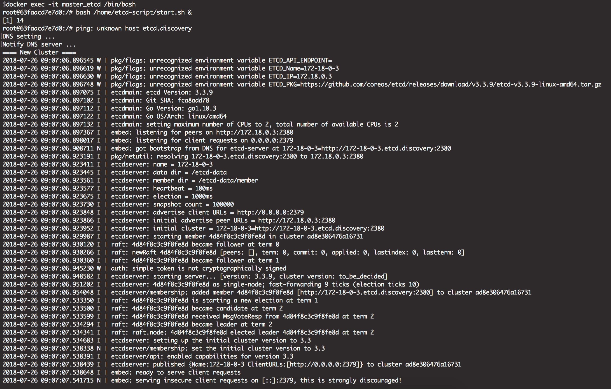

# docker, 本地 : 測試

1. `docker-compose up`
2. etcd container, 可觀察 dns_discovery 這台 container 中的 `/home/dnsmasq/hosts` 與 `/home/dnsmasq/confs` 設定變化
    1. `docker exec -it master_etcd /bin/bash`
    2. 啟動 `bash /home/etcd-script/start.sh &`
    3. 關閉 `bash /home/etcd-script/stop.sh`
3. 測試 cluster
    1. `docker run --rm -it --name s2 --network etcd_network orbweb/etcd:3.3.9-ubuntu16.04 /bin/bash`
    2. 進入 container, 執行 `bash /home/etcd-script/start.sh &`
4. 檢查 cluster 狀態
    - 進入任何一台 etcd container : `etcdctl member list`
    - 用 curl : `curl http://{etcd-ip}:2379/v2/members`

# kubernetes, 本地 : 測試